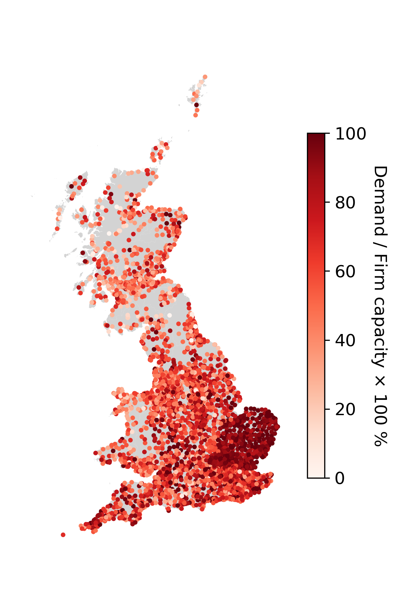

# GB-PS-info 
The growing demand for electrified heating, electrified transportation, and power-intensive data centres used for Artificial Intelligence challenge distribution networks. If electrification projects are carried out without considering electrical distribution infrastructure, there could be unexpected blackouts and financial losses. Dataset containing real-world distribution network information are required to address this. On the other hand, social data, such as household heating composition, are closely coupled with people’s lives. Studying the coupling between the energy system and society is important in promoting social welfare. To fill these gaps, this paper introduces two datasets. The first is a main dataset for the distribution networks in Great Britain (GB), collecting information on firm capacity, peak demands, locations, and parent transmission nodes (the Grid Supply Point, namely GSP) for all primary substations (PSs). PSs are a crucial part of the UK distribution network and are at the lowest voltage level (11 kV) with publicly available data for most UK Distribution Network Operators (DNOs). Substation firm capacity and peak demand facilitate an understanding of the remaining room of the existing network and the parent GSP information helps link the dataset of distribution networks to datasets of transmission networks. These datasets are collected, processed, and merged from various files published by the six DNOs in GB. There were inconsistencies among the names of PSs across files even for the same DNO. A Python script and manual validation are performed to carefully process and merge the corresponding PS information. The second dataset extends the main network dataset, linking each PS to information about the number of households that use different types of central heating recorded in census data (Census in year 2021 for England and Wales, and Census 2011 for Scotland as the most recent Scotland Census 2022 data has not yet been fully released). The derivation of the second dataset is based on locations of PSs collected in the main dataset with appropriate assumptions. The derivation process may also be replicated to integrate other social datasets. 

*Figure 1 Primary substations (PSs) in Great Britain (GB). The colour represents the ratio (%) of the peak demand to the substation firm capacity.*

# Citation 
If you are interested and would like to use this dataset. Please cite our paper: 

"Datasets of Great Britain Primary Substations Integrated with Household Heating Information ", Yihong Zhou, Chaimaa Essayeh, and Thomas Morstyn, 2024, *submitted to Data in Brief*

It is also abailable on [arXiv](https://arxiv.org/abs/2403.16313).

# File Descriptions 
A detailed description of the whole dataset can be found in our paper above.
